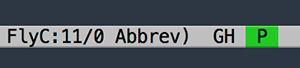
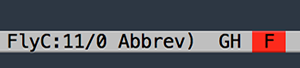

# build-status

Emacs minor mode that shows a buffer's build status in the mode line.





## Usage

`M-x build-status-mode` in a buffer that's part of a CI project.

By default the build status will be checked every 5 minutes. To change this
set `build-status-check-interval` to the desired interval, in seconds.

API tokens can be set via the service-specific variable (see below) or via `git config`:

```
git config --add build-status.api-token TOKEN
```

To open the CI service's web page for buffer's build click on the mode's lighter or
run `M-x build-status-open`.

### Status Mapping

`build-status` will try to convert the CI service's status to one of the following:

* failed
* passed
* queued
* running

This is done via the service's status mapping alist.

If the status is not mapped it's treated as unknown (lighter is `"?"` and mouseover shows
the status as is). You can ignore a status by mapping it to the symbol `ignored`.

See the service's section below for more information.

### Status Text Properties

Each status has associated text properties. These are configured
via `build-status-color-alist`. By default it contains:

```el
'(("failed"
   ((background-color . "red")))
  ("passed"
   ((background-color . "green")))
  ("queued"
   ((background-color . "yellow")))
  ("running"
   ((background-color . "yellow"))))
```

Each value is a list of text (`face`) properties. Set them as you see fit.

### Supported Services

#### CircleCI

The buffer's directory or one of its ancestors must contain a `circle.yml` file.

To set a token (but also see [`git config` tokens](#usage)):

```el
(setq build-status-circle-ci-token "YOUR-TOKEN")
```

Status mapping is controlled via `build-status-circle-ci-status-mapping-alist`. It
defaults to:

```el
'(("infrastructure_fail" . "failed")
  ("not_running" . "queued")
  ("success" . "passed")
  ("scheduled" . "queued")
  ("timedout" . "failed"))
```

#### Travis CI

**Pro and Enterprise not supported. Pull requests welcome!**

The buffer's directory or one of its ancestors must contain a `.travis.yml` file.

To set a token (but also see [`git config` tokens](#usage)):

```el
(setq build-status-travis-ci-token "YOUR-TOKEN")
```

Status mapping is controlled via `build-status-travis-ci-status-mapping-alist`. It
defaults to:

```el
'(("errored" . "failed")
  ("started" . "running")
  ("created" . "queued"))
```

## TODOs

* Support for Enterprise GitHub
* Support for TravisCI Pro and Enterprise
* Support for VCS mode hooks
* Support for AppVeyor

## See Also

* [jenkins-watch](https://github.com/ataylor284/jenkins-watch)
* [github-notifier](https://github.com/xuchunyang/github-notifier.el)
